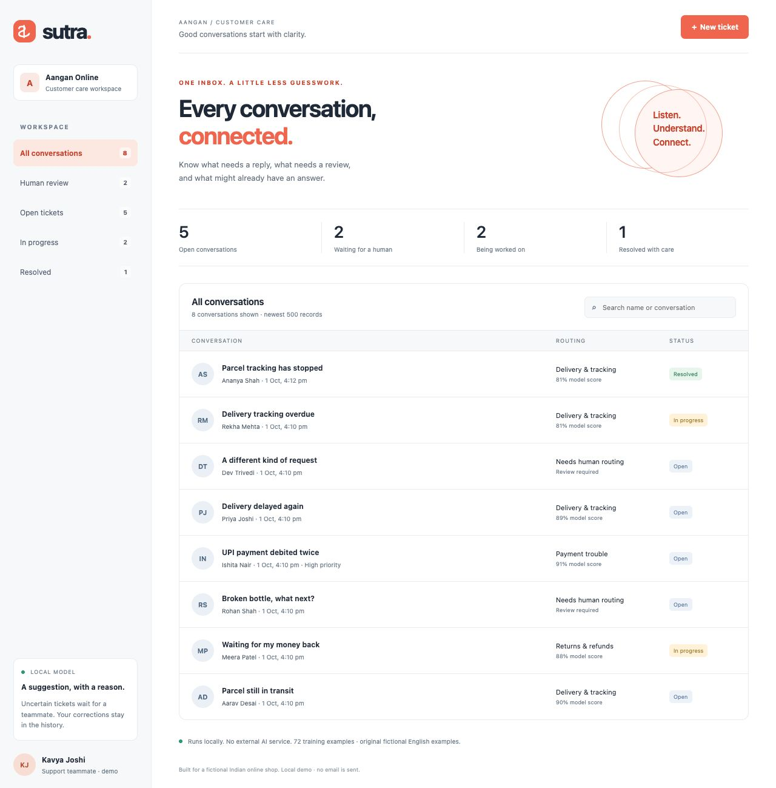
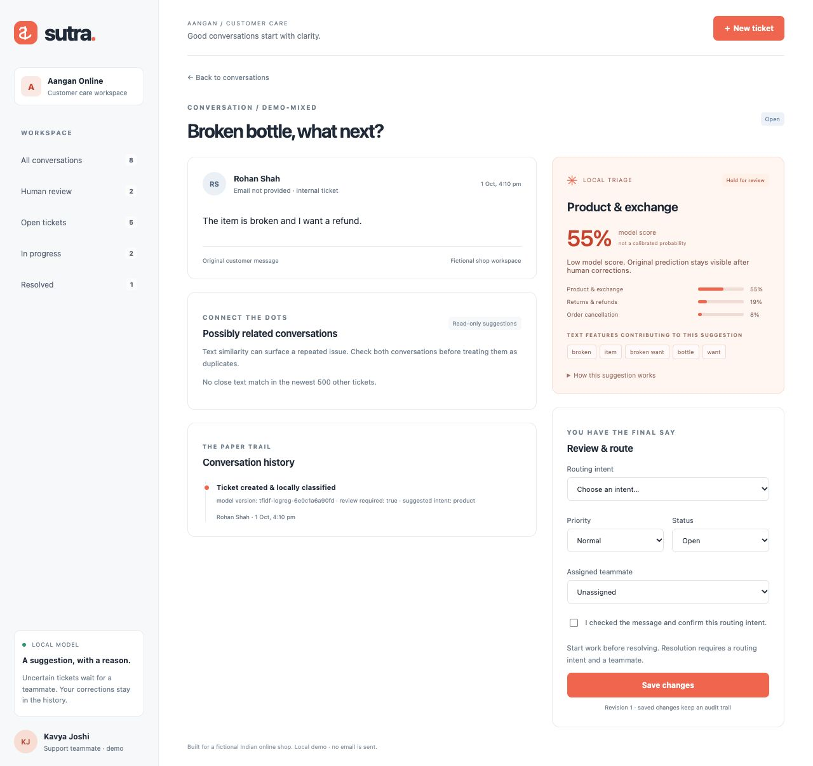
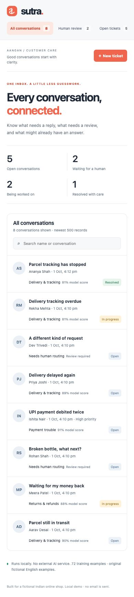

# Sutra — Support Ticket Triage Desk

A Flask support inbox for **Aangan Online**, a fictional Indian shop. A small learned model suggests a ticket intent, holds uncertain messages for human review, and surfaces similar conversations. Teammates can correct routing, assign work and resolve tickets with a revision-checked history.



**Portfolio focus:** practical classification with abstention, inspectable text features, human decisions, duplicate suggestions and concurrent-edit correctness. This is a local single-store demo; it sends no email, performs no refund and needs no external AI key.

## Quick start

Use **Python 3.12**. This project was tested with Python 3.12.14 on Apple Silicon. Python, pip and a browser are the only system prerequisites; no database server or Node build is needed.

```sh
cd support-triage-desk
python3.12 -m venv .venv
source .venv/bin/activate
python -m pip install -r requirements.txt -c constraints-tested.txt
python app.py
```

On Windows PowerShell, replace activation with `.venv\Scripts\Activate.ps1`; use `py -3.12` to create the environment if needed. Open **http://127.0.0.1:8106/**. The first run creates `instance/triage.db`, a private persistent session key, and six fictional tickets. Dependencies download during installation; default training and every subsequent classification run locally.

Other startup options:

```sh
python app.py --port 8206
python app.py --data-dir instance/my-empty-store --no-demo
```

`--no-demo` keeps a **new** database empty; it does not delete existing tickets. Demo seeding occurs only when a database has no tickets. For a clean demo without deleting anything, use a new directory, for example `--data-dir instance/fresh-demo`. Keep the process running while using the browser; stop it with Ctrl+C. The server binds only to `127.0.0.1`, and debug mode is disabled.

## Try the working demo

1. Open **All conversations**. Aarav Desai and Priya Joshi have related parcel problems; Meera Patel's refund is already in progress.
2. Open **Human review → Broken bottle, what next?**. The default model has a low product score and a refund alternative. Its routing starts unassigned.
3. Select **Returns & refunds**, assign **Kavya Joshi**, choose **In progress**, check the human confirmation box, and save. The original product suggestion remains visible; history records the correction.
4. Choose **Resolved** and save. An open ticket cannot jump straight to resolved, and resolution needs an assigned teammate and an explicit human-confirmed route.
5. Open **Parcel still in transit** to inspect **Possibly related conversations**. Similarity is a text-match measure, not a probability that customers have the same problem. Suggestions never merge records.
6. Create a ticket for **Dev Shah**: subject `A question`, message `What is the weather in Surat?`. It is held for human review rather than confidently assigned.
7. Open one ticket in two tabs. Save a priority change in one tab, then save from the older tab. The older revision receives a conflict and cannot overwrite the newer decision; reload it before saving again.



<details>
<summary>Mobile layout</summary>



</details>

## What is learned, and what is a rule?

`triage/model.py` fits a scikit-learn **TF-IDF word/bigram vectorizer + logistic regression** at startup. The default training set is 72 original labelled English examples: 12 each for delivery, refund, cancellation, payment, product and account issues. Neither hardcoded keyword routes nor canned scores generate the predictions. No pickle file or remote model service is loaded.

The review gate is deliberately a separate policy: hold when the best model score is below **0.58**, the top-two gap is below **0.18**, or there is no recognised training vocabulary. These thresholds were set as conservative demo defaults, not calibrated using a production validation set. A clear suggestion creates an open ticket with a suggested intent; it never resolves a ticket or acts on a customer account.

Text evidence lists positive feature contributions for the suggested class. It explains this linear model's vocabulary, not a customer's true intent. Similar-ticket ranking uses cosine similarity in the same TF-IDF space, shows up to three candidates at **0.38** or above, and labels exact normalised matches separately. Routing corrections are auditable but **do not automatically retrain** the classifier.

Model scores are **uncalibrated**. The corpus is tiny and synthetic. High scores can still be wrong, especially for mixed intents, unfamiliar language, typos, negation and changing shop policies. Gujarati/Hindi, conversation threads and production accuracy have not been established. Customer names are fictional; no real customer records are included.

## Evaluation and tests

Install the test tools and run:

```sh
python -m pip install -r requirements-dev.txt -c constraints-tested.txt
python -m pytest --cov=triage --cov-report=term-missing
python scripts/evaluate.py --output instance/evaluation-original.json
python -m pip check
```

Local verification: **77 tests passed**, **98% statement coverage** across `triage/`, and `pip check` reported no broken requirements. Tests cover learned classification, abstention, related-ticket limits, CSRF/origin/host checks, unsafe input shapes, idempotent submissions, human correction, resolution prerequisites, stale revisions, concurrent writers, persistent secrets, dataset boundaries and train/test leakage checks. Browser verification and working screenshots are documented in [VALIDATION.md](docs/VALIDATION.md).

The default evaluation file is separate from training: 24 labelled synthetic messages, six out-of-domain checks and three deliberately mixed-intent messages. It is never read during model fitting.

| Default original fixture evaluation | Result |
| --- | --- |
| Top-intent accuracy | 24 / 24 |
| Macro F1 | 1.000 |
| Suggestions above the review gate | 15 / 24 (62.5% coverage) |
| Correct accepted suggestions | 15 / 15 |
| Labelled messages held for review | 9 / 24 |
| Out-of-domain held | 6 / 6 |
| Mixed-intent held | 3 / 3 |

These numbers verify a small, authored acceptance set; they **do not establish general accuracy**. See [the full original report](docs/evaluation-original.json) and [evaluation notes](docs/EVALUATION.md). CI configuration is prepared locally in `.github/workflows/tests.yml`; remote CI has not been run.

## Optional public-dataset experiment

The default app ships original MIT-licensed examples. A separate opt-in script can download the **Bitext customer-support dataset**, which its publisher describes as hybrid synthetic data. Read its [dataset card](https://huggingface.co/datasets/bitext/Bitext-customer-support-llm-chatbot-training-dataset) and [CDLA-Sharing-1.0 terms](https://cdla.dev/sharing-1-0/) before importing.

```sh
python scripts/import_bitext.py --download --accept-license
python scripts/evaluate.py \
  --training-data instance/bitext/training.json \
  --evaluation-data instance/bitext/evaluation.json \
  --output instance/bitext/evaluation-report.json
python app.py --port 8206 --data-dir instance/public-data-demo \
  --training-data instance/bitext/training.json
```

The importer uses a fixed publisher revision (`430d1a8`), bounds the CSV download to 32 MB, scans at most 50,000 rows and selects 20–200 examples per mapped app intent (default 60). It canonicalises placeholders and duplicates, groups close character n-gram matches before splitting, and preserves a disjoint group assignment. It maps five app intents; the source has no clean product-fault label, so the original product examples remain. It drops assistant-response columns and does not generate replies.

Downloads, modified examples, provenance and row-level evaluation outputs stay under **ignored `instance/bitext/`**. The importer records the publisher, revision, SHA-256, mapping and modification notice, plus a CDLA license link. Do not treat imported Bitext rows as MIT-licensed repository data; if redistributing them, retain attribution, the modification notice and applicable CDLA terms. Changing the training file requires a restart; existing tickets keep their original recorded model version and score.

The actual bounded import was exercised locally: **237 public training examples + 72 original = 309**, with **63 public holdout + 24 original = 87** labelled evaluation messages. Top-intent accuracy was **83/87 (95.4%)**, with **74/87 (85.1%)** suggestion coverage. Six of six out-of-domain checks were held, but only **two of three mixed-intent checks** were held. That missed mixed-intent case is a material limitation; the importer does not promise safer predictions. [Aggregate public experiment results](docs/evaluation-public-summary.json) contain metrics and provenance without the downloaded text. Shared synthetic templates can still inflate performance despite grouping; this is not an independent production benchmark.

## API contract

All responses are JSON except `/` and static assets. `GET /api/bootstrap` creates a signed `sutra_session` cookie and returns a CSRF token. Keep that cookie and send the token in `X-CSRF-Token` on every mutation. Same-origin and trusted-host checks apply. Cookies have a distinct name so other localhost portfolio apps cannot overwrite this session.

| Method and endpoint | Purpose |
| --- | --- |
| `GET /api/health` | Model readiness; no cookie needed |
| `GET /api/bootstrap` | CSRF token, store, teammates, intents, counts and model provenance |
| `GET /api/tickets?queue=review&q=parcel` | Filter/search the newest 500 tickets; queues: all, review, open, in_progress, resolved |
| `POST /api/tickets` | Create and classify a bounded ticket; optional request key prevents repeated submissions |
| `GET /api/tickets/<id>` | Original prediction, current routing, similar tickets and history |
| `PATCH /api/tickets/<id>` | Review/correct routing, priority, teammate and status using the current revision |

Create body:

```json
{
  "customer": "Aarav Desai",
  "email": "aarav@example.test",
  "subject": "Delivery tracking delayed",
  "message": "My delivery is late and the parcel has not arrived.",
  "priority": "normal",
  "request_key": "a-unique-client-request-id"
}
```

Save body:

```json
{
  "revision": 1,
  "intent": "delivery",
  "priority": "high",
  "status": "in_progress",
  "assignee": "Kavya Joshi",
  "reviewed": true
}
```

Supported intents: `delivery`, `refund`, `cancellation`, `payment`, `product`, `account`, and `unassigned` for an unreviewed ticket. Priorities: `low`, `normal`, `high`. Teammates are the fixed demo list from bootstrap. `reviewed` is a boolean and `revision` is a positive integer. A replay of a create request with the same key and same normalised payload returns the original ticket; reusing it with different input gives `409`.

Errors: `400` malformed JSON/untrusted host, `403` CSRF or origin failure, `404` unknown record, `409` stale revision/request-key conflict, `413` body over 32 KB, `415` unsupported content type, `422` invalid fields/workflow. Error responses expose a readable message without a traceback.

## Architecture and assumptions

```text
Browser inbox + review UI
          │ same-origin JSON + signed session + CSRF
          ▼
Flask validation and review policy
     ├── fitted TF-IDF / logistic regression → original prediction
     ├── TF-IDF cosine matching → related conversations
     └── SQLite transaction → current routing + revision + audit events
```

- One fictional shop and one acting reviewer, Kavya Joshi; assignment can target three demo teammates. This is not multi-tenant authentication.
- SQLite uses foreign keys, WAL and a busy timeout. `BEGIN IMMEDIATE` serialises revision-checked updates and audit insertion. A model prediction never overwrites a human correction.
- The UI escapes inserted text or uses `textContent`; it does not execute a customer message. Content Security Policy restricts scripts and styles to local files.
- No automatic merging, notification, live email ingestion, attachment parsing, refund integration or automatic model retraining is implemented.
- The Flask development server and lack of login are appropriate for a loopback portfolio demo. A real deployment would need authentication, tenant authorisation, HTTPS, production serving, rate limits, retention controls and evaluation on consented representative data.
- Newest-500 display/candidate limits bound interactive work; this is not a complete archive search or large-scale semantic retrieval system.

## Repository layout

```text
app.py                       Loopback CLI
triage/__init__.py           HTTP validation, CSRF and API
triage/storage.py            SQLite transactions, revisions and history
triage/model.py              Learned classifier and similarity
triage/demo.py               Fictional Indian demo conversations
triage/templates/index.html  Accessible inbox/review/forms
triage/static/               Responsive styles and browser interactions
data/                       Original training/evaluation examples
scripts/                    Reproduction, evaluation, public importer
tests/                      Offline model/API/concurrency/importer tests
docs/                       Screenshots and evaluation/validation evidence
instance/                   Ignored database, secret and optional downloads
```

`constraints-tested.txt` records the complete locally tested Python dependency resolution. The detailed beginner design document is kept outside this Git repository for private review. Code and original authored examples are MIT licensed; optional imported data retains its own source license.
